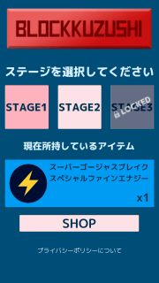
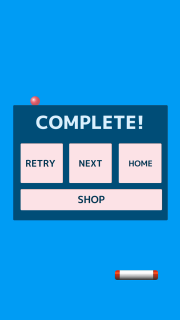
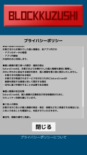
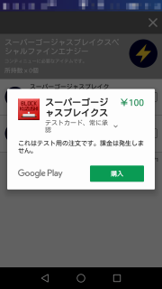
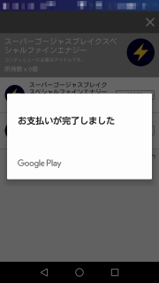
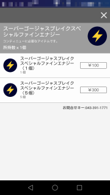

# ブロック崩しの Unity プロジェクト

  
 [Youtube でプレイデモ動画](https://youtu.be/5KTY60i6jDU) もご覧になれます。

.png "Gameover NoItem")
.png "Gameover")

- この Unity プロジェクトは [いますぐ始めるアプリ内課金 - itemstore BLOG](http://blog.item-store.net/archive/category/いますぐ始めるアプリ内課金) の教材サンプルです。  
ブロック崩しのほかに、アプリ内課金の実装方法についても説明しているので、よろしければご覧ください。
- [GooglePlay のブロック崩し（教材）のページ](https://play.google.com/store/apps/details?id=com.SakuraCrowd.test_nonIAP_Unity_BlockKuzushi) から Android 端末(4.2以上)にダウンロードしてプレイできます。  
次の QR コードからも GooglePlay のインストールページにアクセスできます。  

- この Unity プロジェクトにはアプリ内課金の機能は含まれていません。
- この Unity プロジェクトはライセンスに基づき利用していただいてかまいませんが、私は一切の責任を負わず、ご質問やご要望にも対応しないことをご理解ください。
- 開発環境は Unity 2017.2.0f3 (64bit) です。

# Unity での開き方
1. Clone or Download などで sample_blockkuzushi を丸ごとダウンロードします。
1. 圧縮ファイルならば展開します。
1. ダウンロードしたフォルダを Unity の Open で選択し開きます。

# エディタ上でのプレイ方法
Project タブで Assets/Scene/Awake シーンを開きます。  
タイトル画面が表示されたら、再生マークのボタンを押すとマウスでプレイすることができます。

# ビルド方法

Android の apk をビルドするためには、メニュー File > Build Settings で Android を選択します。  
その後、 Build ボタンを押すと作成されますが、その前に以下の設定が必要です。  
教材サンプルでは、その部分が未設定ですので、設定してからビルドしてください。  

Player Settings ボタンを押すと inspector に Android のビルドに関する設定が表示されます。  
そこで以下の設定をしてください。  

- Player Settings
  - Company Name : 作者や製作会社の名前を設定します。
  - Product Name : アプリの名前を設定します。
  - Other Settings
    - Package Name アプリのパッケージ名を設定します。
    - Version : アプリのバージョンを設定します。 1.0 など。
    - Bundle Version Code  : 整数のバージョンコードです。 1, 2, 3 など。
  - Publishing Settings
    - Keystore を作成して選択してください。ビルドする際には Keystore password を 2 箇所に入力する必要があります。

itemstore のアプリ内課金の機能を利用するために、次の設定をしてください。
- AppC オブジェクト
  - Awake シーンの AppC オブジェクトの Android Media Key に itemstore のストア情報にあるメディアキーを設定してください。
- AndroidManifest.xml
  - Plugins/Android/AndroidManifest.xml の [パッケージ名] と書かれている数箇所の部分を、 Player Settings で設定したパッケージ名に置き換えてください。
